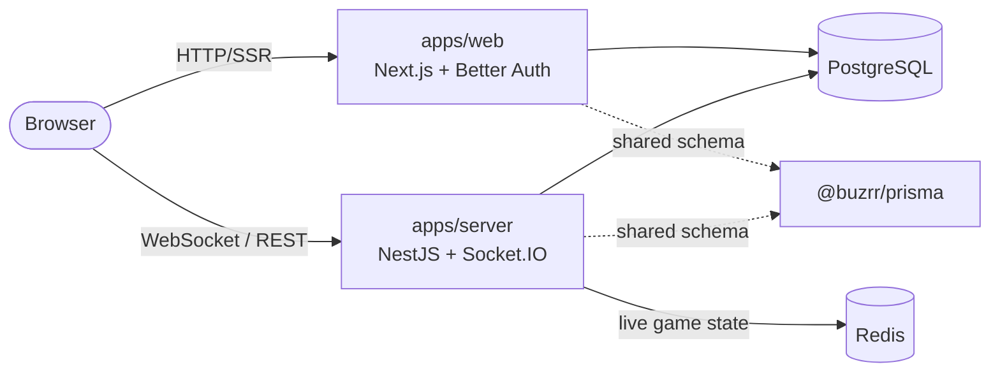
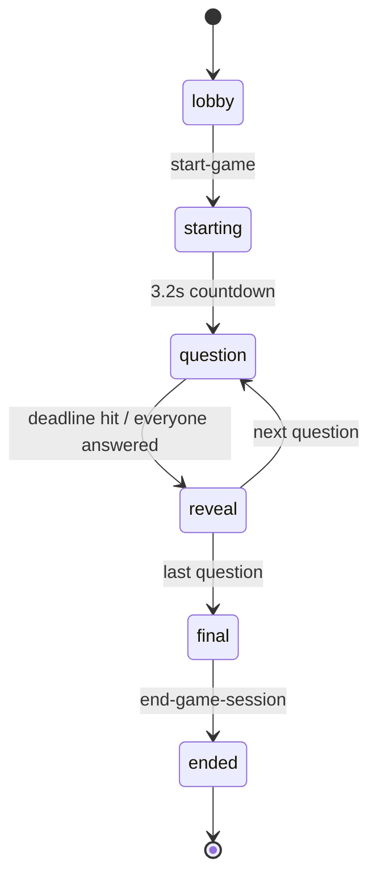

# Buzrr architecture

How Buzrr is put together and why the interesting parts are the way they are.
Start here if you're about to change gameplay, timing, or where state lives.

**The code is the source of truth.** If this file disagrees with the
implementation, the implementation wins — fix the file.

- [Monorepo shape](#monorepo-shape)
- [The server owns the game loop](#the-server-owns-the-game-loop)
- [Who owns the clock](#who-owns-the-clock)
- [Where state lives](#where-state-lives)
- [Going deeper](#going-deeper)

## Monorepo shape

Buzrr is a [Turborepo](https://turbo.build/repo) monorepo with two apps and a shared Prisma package.

| Package                                          | Description                                                                                     |
| ------------------------------------------------ | ----------------------------------------------------------------------------------------------- |
| [`apps/web`](apps/web)                           | Next.js 15 app (React 19, MUI, Redux Toolkit, TanStack Query). Hosts the Better Auth endpoints. |
| [`apps/server`](apps/server)                     | NestJS 11 API + Socket.IO gateway. Owns the realtime game loop.                                 |
| [`@buzrr/prisma`](packages/prisma)               | Prisma schema, migrations and the shared generated client.                                      |
| `@repo/eslint-config`, `@repo/typescript-config` | Shared lint/tsconfig presets.                                                                   |

**Tech stack:** TypeScript · Next.js · NestJS · Socket.IO · Prisma · PostgreSQL · Redis · Better Auth · Gemini · Cloudinary · Turborepo · Yarn 4.

The web app owns authentication and almost nothing else: every domain read and
write goes through the Nest server, which is the only process that touches
gameplay state.

## The server owns the game loop

Clients never decide anything about a game. They send **intent** — `start-game`,
`host-next`, `submit-answer` — and render the state the server pushes back. Every
phase transition, every deadline and every point scored is computed in
[`apps/server/src/modules/game-engine/`](apps/server/src/modules/game-engine).

Both game modes run this same machine. Classic rooms are **host-paced**
(`reveal` waits for the host to advance) and are backed by a `GameSession` lobby
row; duels are **hostless**, exist only in Redis, and auto-advance after a 4s
reveal.

Because the server measures time, answers can't be spoofed by a fast client:
score comes from the server's own clock (1000 points at _t=0_ decaying to 100 at
the time limit), correct-option IDs are only broadcast once the question closes,
and answers are first-write-wins per player per question.

The socket contract has exactly one version — the server emits and accepts
precisely what the current client speaks. Compatibility aliases for older
clients are deliberately not kept; both apps deploy from this repo, so a
contract change migrates both sides at once.

## Who owns the clock

This is the part that constrains everything else. A game's timer must fire
exactly once even though **N server instances** are running, any of which may
crash mid-question.

- **Deadlines live in Redis**, not in a process. Every pending transition is a
  member of one sorted set (`games:deadlines`, score = fire-at epoch ms), so a
  game's schedule survives the process that created it.
- **A per-game owner lock decides who fires it.** Before acting on a deadline an
  instance must hold `game:{code}:owner` (`SET NX PX 20s`, renewed by a Lua
  compare-and-extend). Losers return silently — so a timer that fires on three
  instances still advances the game once.
- **In-process timers are a fast path, not the source of truth.** `setTimeout`
  gives millisecond precision; a **15s sweeper** re-fires any deadline that came
  due without being handled — the backstop for a crashed instance or a lost
  timer. The sweeper starts lazily and stops once no deadlines remain (an
  unconditional poll would cost ~350K Upstash commands/month at zero users).
- **Restarts recover.** On boot the engine reads the deadline set, fires what is
  overdue, re-arms what isn't, and re-schedules any bot answer that was already
  committed before the restart.
- **Host-paced phases park their deadline** at the TTL horizon rather than
  dropping it, which keeps the room visible to the sweeper that ends games whose
  host has been gone for 5 minutes.

Clients render countdowns from the `deadline` the server sends, correcting for
clock skew with the `serverNow` stamped on the same payload — never from a local
timer. A reconnecting client emits `request-sync` and gets a full `state-sync`
snapshot (phase, question, deadline, roster, its own answer) instead of replaying
missed events.

## Where state lives

|              | Redis                                                                                          | PostgreSQL                                                                |
| ------------ | ---------------------------------------------------------------------------------------------- | ------------------------------------------------------------------------- |
| **Holds**    | Everything live: phase, questions, per-question answers, scores, roster, owner lock, deadlines | The lobby record (`GameSession`) and the immutable `GameResult` + entries |
| **Lifetime** | Deleted when the game ends                                                                     | Permanent (the room row is torn down; the result is kept)                 |

Nothing per-answer or mid-game is ever written to Postgres — a finished game is
persisted once, in a transaction that also applies the duel ELO update. Redis is
therefore a hard dependency: the server does not boot without it.

Socket.IO runs the **Redis adapter**, so broadcasts reach players on any
instance, and each player also joins a private `player:{id}` room used for
personal results.

## Going deeper

This file is the orientation layer. The full reference lives in
[`docs/architecture/`](docs/architecture/):

| Topic                                                    | Doc                                                      |
| -------------------------------------------------------- | -------------------------------------------------------- |
| Engine internals, socket contract, reconnect, kick/ban   | [realtime.md](docs/architecture/realtime.md)             |
| Postgres models, Redis keyspace, schema-change workflow  | [data.md](docs/architecture/data.md)                     |
| Matchmaking, duel invites, bots, ELO                     | [duels.md](docs/architecture/duels.md)                   |
| REST surface, Nest modules, validation, rate limiting    | [backend.md](docs/architecture/backend.md)               |
| Pages, components, Redux/React-Query state, socket hooks | [frontend.md](docs/architecture/frontend.md)             |
| Login, JWTs, socket auth, roles, guards                  | [auth.md](docs/architecture/auth.md)                     |
| Env vars, deployment, CI, Docker, external services      | [infrastructure.md](docs/architecture/infrastructure.md) |
| Rules you must not break                                 | [invariants.md](docs/architecture/invariants.md)         |
| Why it's built this way                                  | [`docs/adr/`](docs/adr/)                                 |

Working on this codebase with an AI agent? [AGENTS.md](AGENTS.md) is the entry
point, and [docs/CONTEXT.md](docs/CONTEXT.md) describes the current state.
