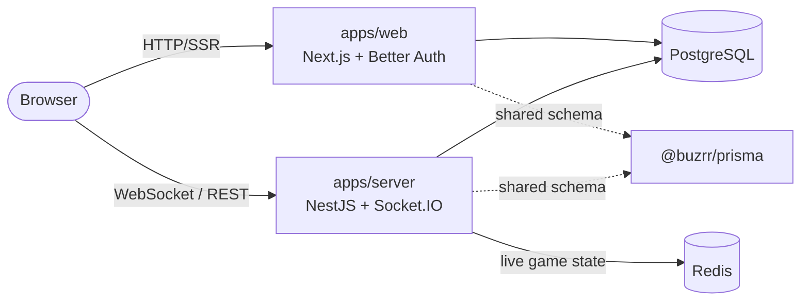

<div align="center">

# ⚡︎ Buzrr

**Open-source QuizUp and Kahoot, together in one app.** Go head-to-head in
ranked 1v1 quiz battles like QuizUp, host live multiplayer quiz rooms like
Kahoot, and generate whole quizzes with AI.

[](LICENSE)
[](CONTRIBUTING.md)
[](https://nextjs.org/)
[](https://nestjs.com/)

</div>

---

## ✨ Features

- 🎮 **Live multiplayer quizzes** (the Kahoot half) — host a room, players join with a code, everyone answers in real time over WebSockets.
- ⚔️ **Ranked 1v1 duels** (the QuizUp half) — matchmaking with an **ELO** rating system.
- 🤖 **AI quiz generation** — describe a topic and let **Gemini** draft the questions (optional).
- 🛡️ **Public question moderation** — community questions feed the duel pool behind an approve/report workflow.
- 🖼️ **Media questions** — image uploads via **Cloudinary** (optional).
- 🔐 **Google sign-in** — authentication powered by [Better Auth](https://better-auth.com).
- ⚡ **Server-authoritative game loop** — live state lives in **Redis**; only finished games are persisted to Postgres.

## 🏗️ Architecture

Buzrr is a [Turborepo](https://turbo.build/repo) monorepo with two apps and a shared Prisma package.



| Package                                          | Description                                                                                     |
| ------------------------------------------------ | ----------------------------------------------------------------------------------------------- |
| [`apps/web`](apps/web)                           | Next.js 15 app (React 19, MUI, Redux Toolkit, TanStack Query). Hosts the Better Auth endpoints. |
| [`apps/server`](apps/server)                     | NestJS 11 API + Socket.IO gateway. Owns the realtime game loop.                                 |
| [`@buzrr/prisma`](packages/prisma)               | Prisma schema, migrations and the shared generated client.                                      |
| `@repo/eslint-config`, `@repo/typescript-config` | Shared lint/tsconfig presets.                                                                   |

**Tech stack:** TypeScript · Next.js · NestJS · Socket.IO · Prisma · PostgreSQL · Redis · Better Auth · Gemini · Cloudinary · Turborepo · Yarn 4.

## 🚀 Quick start

### Prerequisites

- [Node.js](https://nodejs.org) **≥ 18** (20 LTS recommended) — Yarn 4 is bundled via Corepack.
- [Docker](https://docs.docker.com/get-docker/) (for the local Postgres + Redis).
- **Google OAuth credentials** — the only thing you _must_ provide, or login won't work.
  Create them in the [Google Cloud Console](https://console.cloud.google.com/apis/credentials)
  with redirect URI `http://localhost:3000/api/auth/callback/google`.

### One-command setup

```sh
corepack enable          # makes the pinned Yarn 4 available (first time only)
yarn install             # install dependencies
yarn setup               # ⬅️ starts Postgres + Redis, writes .env files, pushes the schema
```

`yarn setup` spins up the databases in Docker, generates local `.env` files
(with a shared auth secret), and syncs the schema — see [`scripts/setup.mjs`](scripts/setup.mjs).
It's **idempotent and safe to re-run**: existing values are never overwritten,
and if a required key goes missing from a `.env` file it's re-added with the
local default.

Then add your Google credentials to **`apps/web/.env`**:

```dotenv
GOOGLE_CLIENT_ID="your-client-id"
GOOGLE_CLIENT_SECRET="your-client-secret"
```

…and start everything:

```sh
yarn dev                 # web → http://localhost:3000   api → http://localhost:3001
```

That's it. Everything else is optional.

### Optional features

| Feature            | Add to `.env`                                                          | Where to get it                                            |
| ------------------ | ---------------------------------------------------------------------- | ---------------------------------------------------------- |
| AI quiz generation | `GEMINI_API_KEY`                                                       | [Google AI Studio](https://aistudio.google.com/app/apikey) |
| Image uploads      | `CLOUDINARY_CLOUD_NAME`, `CLOUDINARY_API_KEY`, `CLOUDINARY_API_SECRET` | [Cloudinary](https://cloudinary.com)                       |
| Rate limiting      | `RATELIMIT=ON` + `UPSTASH_REDIS_REST_URL`, `UPSTASH_REDIS_REST_TOKEN`  | [Upstash](https://upstash.com)                             |

## 🔧 Environment variables

`yarn setup` writes sensible local defaults; these are the ones you'll touch. See
the [`.env.example`](.env.example) files for the full, commented list.

| Variable                                         | Required | Purpose                                                             |
| ------------------------------------------------ | :------: | ------------------------------------------------------------------- |
| `GOOGLE_CLIENT_ID` / `GOOGLE_CLIENT_SECRET`      |    ✅    | Google sign-in (web). Without them, auth throws.                    |
| `BETTER_AUTH_SECRET`                             |    ✅    | Signs/verifies session JWTs. **Must match** between web and server. |
| `DATABASE_URL` / `DIRECT_URL`                    |    ✅    | PostgreSQL connection (defaults to the Docker container).           |
| `REDIS_URL`                                      |    ✅    | Redis for live game state (server won't boot without it).           |
| `NEXT_PUBLIC_SOCKET_URL` / `NEXT_PUBLIC_API_URL` |    ✅    | Where the browser reaches the API.                                  |
| `GEMINI_API_KEY`                                 |    ➖    | Enables AI quiz generation.                                         |
| `CLOUDINARY_*`                                   |    ➖    | Enables image uploads.                                              |
| `UPSTASH_REDIS_REST_*` + `RATELIMIT`             |    ➖    | Enables rate limiting.                                              |

## 📜 Scripts

Run from the repo root:

| Command                               | What it does                                             |
| ------------------------------------- | -------------------------------------------------------- |
| `yarn setup`                          | One-command local bootstrap (Docker DBs + env + schema). |
| `yarn dev`                            | Run web + server with hot reload.                        |
| `yarn dev:web` / `yarn dev:server`    | Run a single app.                                        |
| `yarn build`                          | Build all apps (what CI runs).                           |
| `yarn lint` / `yarn check-types`      | Lint / type-check.                                       |
| `yarn format`                         | Prettier over the repo.                                  |
| `yarn db:push`                        | Sync the Prisma schema to the database.                  |
| `yarn db:studio`                      | Open Prisma Studio.                                      |
| `yarn docker:up` / `yarn docker:down` | Start / stop the Postgres + Redis containers.            |
| `yarn docker:reset`                   | Wipe the databases and re-run setup.                     |

### Troubleshooting

- **`Cannot resolve environment variable: DIRECT_URL`** — the Prisma CLI reads
  `DATABASE_URL`/`DIRECT_URL` from the root `.env`. If you emptied or edited it,
  just re-run `yarn setup`; it restores any missing required keys.
- **`Cannot connect to the Docker daemon`** — start Docker Desktop, then re-run
  `yarn setup`.
- **Fresh start** — `yarn docker:reset` wipes the local databases and
  re-bootstraps everything.

## 🗂️ Project structure

```text
buzrr/
├── apps/
│   ├── web/        # Next.js app (+ Better Auth)
│   └── server/     # NestJS API + Socket.IO
├── packages/
│   ├── prisma/     # schema, migrations, generated client
│   ├── eslint-config/
│   └── typescript-config/
├── docker-compose.yml   # local Postgres + Redis
└── scripts/setup.mjs    # one-command bootstrap
```

## 🚢 Deployment & CI

Every push and PR runs the [`CI` workflow](.github/workflows/ci.yml) (lint,
type-check, build against real Postgres + Redis). To gate production deploys on
it, open your Vercel project → **Settings → Git → Deployment Checks** and add
the CI workflow's **"Lint, typecheck & build"** job as a required check —
deployments then only go live once CI is green, and a failing run leaves the
current production deployment in place.

`apps/web` deploys to Vercel; `apps/server` (Socket.IO, long-lived) needs a
container/VM host such as Render, Railway or Fly. Both apps read their config
from environment variables — see the [`.env.example`](apps/web/.env.example)
[files](apps/server/.env.example) for what each host needs. For production
databases, apply the committed migrations with `prisma migrate deploy` (local
dev uses `db push` via `yarn setup`).

## 🤝 Contributing

Contributions are welcome! Please read [**CONTRIBUTING.md**](CONTRIBUTING.md) and
our [Code of Conduct](CODE_OF_CONDUCT.md) before opening a PR. Found a security
issue? See [SECURITY.md](SECURITY.md).

## 📄 License

[GPL-3.0](LICENSE) © Buzrr contributors
