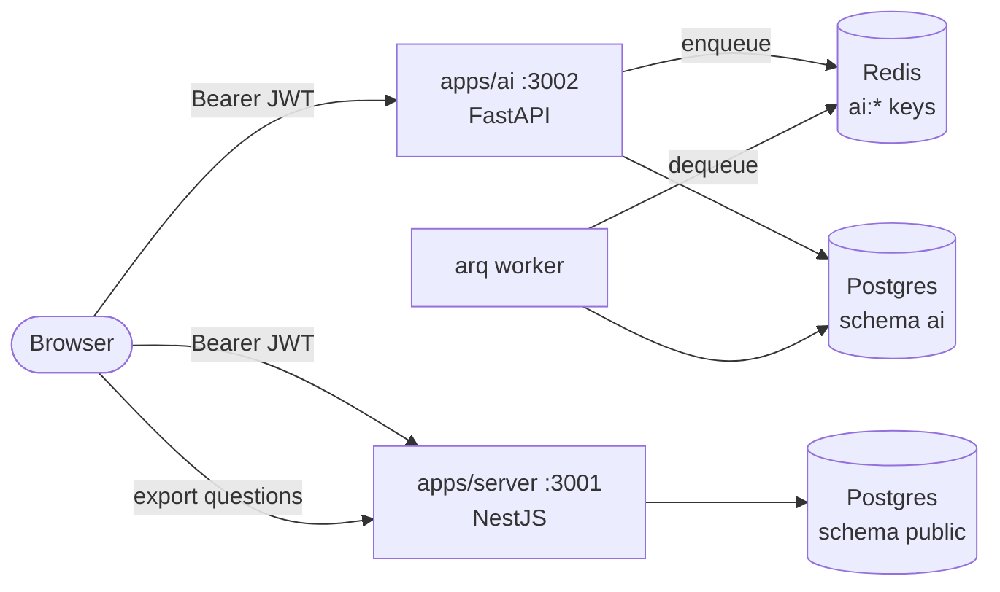

# Buzrr-AI — Knowledge Spaces and RAG quiz generation

`apps/ai` — Python 3.12 + FastAPI on `:3002`, plus an arq worker. Users upload
their own documents into a **Knowledge Space**; the service indexes them and
generates quiz questions grounded in that material, with citations.

Why it is a separate service at all: [ADR-009](../adr/009-buzrr-ai-rag-service.md).
This file is the reference for how it works.

> **The service is optional.** With `NEXT_PUBLIC_AI_API_URL` unset the sidebar
> entry disappears and web+server run exactly as before. `yarn setup` and
> `yarn dev` need no Python toolchain.

## Shape



Two processes from one image: the HTTP service and the worker. Ingestion is
CPU-bound (PDF parsing) and must never share an event loop with request handling
— still less with the game engine (ADR-002).

## Ownership boundaries

|               | Owns                                                         | Never                                                  |
| ------------- | ------------------------------------------------------------ | ------------------------------------------------------ |
| `apps/ai`     | `ai` schema, `ai:*` Redis keys, spaces/documents/chunks/runs | Writes to `public.*`; mints tokens; touches game state |
| `apps/server` | `public` schema, quizzes, gameplay                           | Reads the `ai` schema; calls the AI service            |
| `apps/web`    | Both clients, and the export handoff                         | —                                                      |

**Alembic never touches `public`; Prisma never touches `ai`** ([invariant #30](invariants.md)).
`alembic/env.py` enforces this with `include_object`, and there are deliberately
no foreign keys from `ai.*` into `public.users` — `user_id` is a plain text column
holding the JWT `sub`.

## Data model (`ai` schema)

| Table                 | Notes                                                                                                                                                |
| --------------------- | ---------------------------------------------------------------------------------------------------------------------------------------------------- |
| `knowledge_spaces`    | `UNIQUE(user_id, name)` — one user's spaces are named uniquely, another user may reuse a name                                                        |
| `documents`           | `status` ∈ `queued\|processing\|ready\|failed`; `UNIQUE(space_id, sha256)` makes re-uploading identical bytes a no-op                                |
| `chunks`              | text + `embedding vector(768)` + `heading_path text[]` + page range; `space_id`/`user_id` denormalised so retrieval filters by tenant without a join |
| `generation_runs`     | one per generate request: prompt, resolved plan, model, latency                                                                                      |
| `generated_questions` | `options` JSONB already in Buzrr's `{title,isCorrect}` shape, so export is a pass-through                                                            |
| `question_citations`  | snapshot of document/page/heading, so a citation still renders after its chunk is re-ingested (`chunk_id` is `ON DELETE SET NULL`, not CASCADE)      |

**Embedding dimension is 768**, from `gemini-embedding-001` truncated via MRL and
**re-normalised** — truncation breaks the unit length that cosine distance
assumes. 3072 would exceed pgvector's 2000-dimension HNSW ceiling.

Indexes: HNSW (`vector_cosine_ops`, `m=16`, `ef_construction=64`) for ANN, a btree
on `space_id` so the scan stays scoped to one tenant, and a generated `tsvector`
column with a GIN index — **shipped but not yet used**, reserved for a hybrid BM25
path so enabling it later needs no migration.

## Ingestion pipeline

`POST /api/ai/spaces/{id}/documents` streams each file to `AI_TMP_DIR`, inserts a
`documents` row, enqueues one arq job per document and returns `202` immediately.
The worker then:

1. **Parse** — PyMuPDF (PDF), python-docx (DOCX), a Markdown/plain reader (MD/TXT).
   Each produces `Block(text, page, heading_level)`; everything format-specific
   stops there.
2. **Clean** — Unicode normalisation, rejoining words split across line breaks,
   dropping bare page numbers, and removing **running headers/footers** (detected
   by a short line repeating across ≥50% of pages, not by position — which
   survives inconsistent margins).
3. **Chunk** — structure-aware, not a fixed window. Blocks are walked in order
   maintaining a heading-path stack; a chunk closes at the size budget _or_ at any
   heading of level ≤ 2, so a chunk can never straddle two top-level sections.
   ~800 tokens target, ~120 overlap, hard cap well under the model's **2048-token
   input limit**.
4. **Embed** — batched ~100 at a time, exponential backoff on 429/5xx.
5. **Persist** — chunks are **deleted and re-inserted** in one transaction, which
   is what makes a retry idempotent.
6. **Delete the source file.**

### Failure and recovery

- A document is claimed with a conditional `UPDATE ... WHERE status IN ('queued','failed')`,
  so an arq redelivery cannot double-index it.
- Each document is independent: one bad PDF in a ten-file upload leaves the other
  nine `ready`.
- On success the temp file is deleted. **On failure it is deliberately kept**, or
  `POST /documents/{id}/retry` would have nothing to re-parse.
- An hourly `sweep_temp_files` cron deletes temp files older than 6h and fails
  documents stuck in `processing` for over 30 minutes (a worker died). Idempotent,
  so it needs no lock — the same "recovery is a first-class path" stance as the
  game engine (invariant #10).

## Retrieval and generation

A request like _"Generate 10 questions for Unit 4, Subsection 2"_ is not a search
query — "Unit 4" is a **locator**, and its embedding looks nothing like the
content of Unit 4. So:

1. **Plan** — one small structured Gemini call (temperature 0) extracts
   `{search_query, section_filter, question_count, question_types, difficulty}`.
   Explicit UI controls override whatever it inferred from prose.
2. **Filter + search** — `section_filter` becomes an ILIKE over the flattened
   `heading_path`; the vector search runs inside it. A filter matching nothing
   **falls back to unfiltered search** rather than returning an empty result.
3. **Diversify** — top-40 candidates reduced to ~12 by MMR. Plain top-k tends to
   return ten restatements of one paragraph, which produces ten near-duplicate
   questions. Lower `AI_MMR_LAMBDA` favours coverage over pure relevance.
4. **Generate** — excerpts are labelled `[S1]…[Sn]`; Gemini returns JSON matching
   a Pydantic schema and cites those labels in `source_refs`.
5. **Map citations back** — labels resolve to chunk ids server-side. A label the
   model invented simply fails to resolve, so it yields _no_ citation rather than
   a fabricated one. This is why labels are used instead of asking the model to
   echo UUIDs.

### Question types

`MCQ` (exactly 4 options, exactly one correct) and `TRUE_FALSE` (2 derived
options). Adding a type is three edits in `generation/schemas.py` plus one prompt
fragment — the API, persistence and export layers all work off `options`/`stem`.

## Auth

Same secret, same token, same claims as the Nest server ([auth.md](auth.md)):
HS256 over `BETTER_AUTH_SECRET`, `{sub, email?, typ?}`. `typ: "player"` is
**rejected** — Knowledge Spaces are account-scoped (invariant #12).

- Tenant isolation: every repository function takes `user_id`; missing and
  not-yours both return **404** (`"Unauthorized or ..."`), matching the Nest
  services so ownership never leaks through a 403/404 distinction.
- CORS: `AI_WEB_ORIGIN`, comma-separated. Unlike the Nest server's
  `parse-cors-origin.ts`, **unset fails closed**.
- Rate limits are **per user**, not per IP (the Nest server's are per IP): the
  cost of embedding and generation is attributable to an account, and a shared
  campus NAT should not let one student exhaust everyone's budget.

## HTTP surface

`/health` (bare, matching Nest's shape and 200/503 semantics); everything else
under `/api/ai`:

```
GET|POST         /spaces                       list / create
GET|PATCH|DELETE /spaces/{id}
POST             /spaces/{id}/documents        multipart, 1..N files → 202
GET              /spaces/{id}/documents
GET              /spaces/{id}/status           polled while ingesting
DELETE           /documents/{id}
POST             /documents/{id}/retry
POST             /spaces/{id}/generate         → a full run with questions
GET              /spaces/{id}/runs
GET|DELETE       /runs/{id}
PATCH            /runs/{id}/questions/{qid}    edit / discard before export
```

Errors use **Nest's envelope** — `{ message, statusCode }`, with validation
errors as a string array — so the web client's `getApiErrorMessage` works
unchanged across both services.

## Export to a Buzrr quiz

`POST /api/quizzes/import` on the **Nest** server (`QuizzesService.importQuestions`):
one transaction, questions land as `draft`, `order` assigned 1..n. Accepts 2–6
options per question.

> Gameplay renders `options.map` generically and duel eligibility only requires
> `options.length >= 2`, so a True/False question **plays** correctly. But
> `AddQuesForm` / `upsertFromMultipart` still assume exactly 4 options, so an
> exported True/False question cannot yet be _edited_ in the question editor.

## Frontend

Routes `/admin/ai` and `/admin/ai/[spaceId]` under the `(mains)` group, so the
existing `AdminShell` sidebar comes for free. Data through
`src/lib/modules/ai/{api,hooks}.ts` and `getAiApiClient()`, which reuses the same
`fetchApiAccessToken()` as the Nest client. Ingestion progress polls
`/spaces/{id}/status` every 3s **only while `isProcessing`** — an idle workspace
makes no requests. No Redux: all of it is server state.

## Deployment (Render)

`render.yaml` at the repo root defines two services from the one Docker image
(`apps/ai/Dockerfile`):

- **`buzrr-ai`** — a Web Service running the default `uvicorn` `CMD`, serving
  `/api/ai/*` and `/health`.
- **`buzrr-ai-ingest`** — a **Cron Job**, not a Background Worker, running
  `arq buzrr_ai.worker.WorkerSettings --burst` every 2 minutes.

That second choice is deliberate, not a shortcut: Render's Background Worker
has **no free instance type** — it's a 24/7 process, billed like an always-on
Web Service. A Cron Job bills per minute actually running. `--burst` makes arq
drain whatever's queued and exit, which is exactly the shape a scheduled job
wants, and it keeps the property that mattered most — a crash during parsing
(a native PyMuPDF segfault, or an OOM kill on a hostile PDF) only takes down
that one cron run, never the API process serving everyone else's requests.

The tradeoff is upload-to-processed latency of up to ~2 minutes instead of
near-instant — a non-issue for a background job nobody is watching in real
time.

**One subtlety if you ever touch `worker.py`:** `WorkerSettings.cron_jobs`
(arq's own hourly scheduler, `minute=7`) does **not** fire reliably under
`--burst` — verified against arq 0.28's source: a cron entry's `next_run` is
computed relative to _that process's own start time_, and a burst invocation
is a fresh process every time, so `next_run` is always in the future relative
to itself and the process exits before it ever elapses. The sweep still runs
every 2 minutes in this deployment shape anyway, via `on_startup`, which fires
unconditionally on every invocation. `cron_jobs` stays in the code because
it's what covers the _other_ deployment shape — a long-running Background
Worker or local `docker compose --profile ai up` — where `on_startup` only
fires once at boot.

If you deploy the worker as an actual Background Worker instead (accepting
the $7/mo-class cost for near-instant processing and simpler mental model),
drop `--burst` and run `arq buzrr_ai.worker.WorkerSettings` — the code doesn't
change, only which of the two services in `render.yaml`/`docker-compose.yml`
you use.

## Local development

```bash
docker compose up -d postgres redis
yarn workspace ai setup            # creates apps/ai/.venv
cp apps/ai/.env.example apps/ai/.env
yarn workspace ai migrate:deploy
yarn workspace ai dev              # API  :3002
yarn workspace ai worker           # ingestion worker
```

Or `docker compose --profile ai up -d` to run both without a host Python
toolchain. `BETTER_AUTH_SECRET` must match web and server — `yarn setup` keeps
all three in sync (`resolveAuthSecret` scans `apps/ai/.env` too).

## Testing

The first automated tests in this repo. Unit tests cover the chunker, cleaner,
parsers, JWT verification (including the player-token rejection), the structured
schemas and citation mapping. Integration tests run the real app against real
pgvector and cover ingestion, retrieval, generation and — most importantly —
**tenant isolation on every route**. Both providers are faked behind their
protocols: **no test ever calls Gemini.** Integration tests skip cleanly when no
database is reachable.
