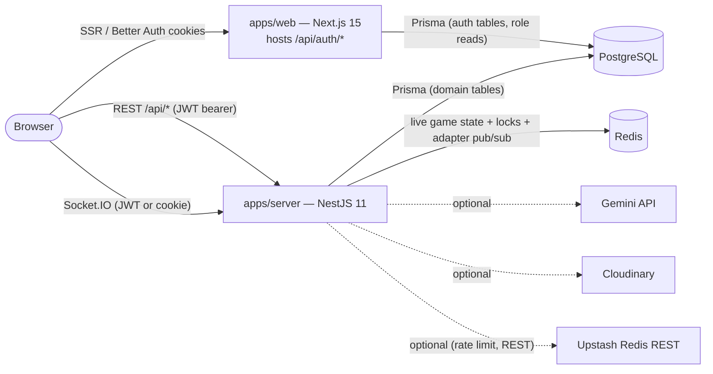

# System overview

> Verified against the code on 2026-08-14. If this drifts from the code, the
> code wins — fix this file.

## Topology



Two deployable apps, one shared DB package:

- **`apps/web`** — Next.js App Router frontend. Its only API routes are Better
  Auth (`src/app/api/auth/[...all]/route.ts`) and a JWT minting endpoint
  (`src/app/api/auth/access-token/route.ts`). All domain data flows through the
  Nest server; the web app touches Postgres directly only for auth/session and
  role lookups (`src/lib/auth.ts`, `src/lib/get-current-role.ts`, both
  `server-only`).
- **`apps/server`** — single NestJS process serving REST under the global
  prefix `/api` (health check exempt at `/health`) **and** the Socket.IO
  gateway on the same port (`src/main.ts`). Owns every game rule.
- **`packages/prisma`** — `@buzrr/prisma`. One schema, one generated client
  (into `generated/client`, exported via `src/index.ts` with a global-singleton
  `prisma` and `connectDatabase()` retry helper).

## The two game modes share one engine

Both classic rooms and 1v1 duels run on the same phase machine in
`apps/server/src/modules/game-engine/game-engine.service.ts`:

```text
lobby → starting → question ⇄ reveal → final → ended
```

- **Classic**: host-paced. A `GameSession` row in Postgres backs the lobby
  (join checks, room codes); `hostNext` drives phase advances; reveal/final
  wait for the host.
- **Duel**: hostless and Redis-only — **no `GameSession` row exists**. The
  engine auto-advances (reveal lasts 4s) and applies ELO at the end.

During play, all mutable state (meta, question snapshot, answers, leaderboard,
roster, bans) lives in Redis under `game:{code}:*` with a 6h TTL
(`game-store.service.ts`). When a game ends, the only durable artifact is an
immutable `GameResult` + `GameResultEntry` rows in Postgres; the `GameSession`
row and all Redis keys are deleted.

## Request/data paths at a glance

| Interaction                         | Path                                                                                                                                                             |
| ----------------------------------- | ---------------------------------------------------------------------------------------------------------------------------------------------------------------- |
| Sign in                             | Browser → web `/api/auth/*` (Better Auth, Google OAuth) → Postgres session                                                                                       |
| Web → API auth                      | Browser fetches `/api/auth/access-token` (web signs HS256 JWT with `BETTER_AUTH_SECRET`) → sends `Authorization: Bearer` to Nest                                 |
| CRUD (quizzes, questions, history…) | React Query hooks (`apps/web/src/lib/modules/*`) → axios → Nest controllers → services → Prisma                                                                  |
| Live gameplay                       | Socket.IO client hooks (`apps/web/src/hooks/use*Socket*.ts`) → `RealtimeGateway` → `GameEngineService` → Redis; engine broadcasts to rooms via the Redis adapter |
| Matchmaking                         | Socket `userType=duel` → `MatchmakingService` (Redis zset queue, 2s worker) → `engine.startDuel`                                                                 |
| AI quiz generation                  | Nest `POST /api/quizzes/ai` → Gemini (`quizzes.service.ts`) — server-side only                                                                                   |
| Image upload                        | Multipart `POST /api/quizzes/:quizId/questions` → Cloudinary (`common/services/cloudinary.service.ts`)                                                           |

## Key directories

```text
apps/server/src/
  main.ts                 # bootstrap: /api prefix, CORS, RedisIoAdapter, filters
  app.module.ts           # module wiring + global JwtAuthGuard
  redis/                  # 3 ioredis clients (commands/pub/sub) + socket.io adapter
  prisma/                 # PrismaService (thin wrapper over @buzrr/prisma singleton)
  common/                 # guards, decorators, filters, Cloudinary, rate limit, elo/score/bot utils
  modules/
    game-engine/          # ★ authoritative loop + Redis store + duel bot driver
    realtime/             # ★ Socket.IO gateway, connection validation, typed events
    duel/                 # matchmaking, friend invites, duel question pool, ELO endpoints
    game-sessions/        # classic rooms: create/join/kick/ban/end + history/results
    quizzes/ questions/   # quiz + question CRUD (incl. Gemini AI generation)
    moderation/           # public-question approve/report queue
    players/              # ephemeral guest identities + player JWTs
    admin-users/ users/   # superadmin role management; profile stats
    auth/ health/         # passport-jwt strategy; /health probe

apps/web/src/
  app/                    # App Router: admin/* (host), player/*+join/* (guest), duel/*, auth, landing
  hooks/                  # useGameSocket (core), useAdminSocket, usePlayerSocket, useDuelQueue, useDuelInvite, useServerCountdown
  state/                  # Redux Toolkit; game/gameSlice.ts mirrors server-pushed live state
  lib/api/                # axios clients + access-token cache
  lib/modules/<domain>/   # api.ts + hooks.ts (React Query) per backend domain
  types/socket-events.ts  # client copy of the socket contract
  components/             # Admin/, Player/, Duel/, Landing/, ui/
```

## Buzrr-AI (`apps/ai`)

A fourth, **optional** deployable unit: Python 3.12 + FastAPI on :3002 plus an
arq worker. Users upload documents into a Knowledge Space; the service indexes
them (pgvector) and generates cited quiz questions from them. It shares Buzrr's
Postgres (its own `ai` schema), Redis (`ai:*` keys) and JWT secret, and writes
nothing to `public` — generated questions become a real quiz only through
`POST /api/quizzes/import` on the Nest server.

Unset `NEXT_PUBLIC_AI_API_URL` and it disappears from the UI entirely.
Detail: [ai.md](ai.md) · rationale: [ADR-009](../adr/009-buzrr-ai-rag-service.md).

## What is deliberately NOT here

- **No message queue / event bus** — cross-instance coordination is Redis
  (socket.io adapter pub/sub, locks, sorted-set deadlines), not a broker.
- **No test suite** — CI is lint + typecheck + build only (`.github/workflows/ci.yml`).
- **No web middleware auth** — route protection is per-layout/per-page server
  components (`apps/web/src/app/admin/layout.tsx`, `lib/duel-session.ts`).

## Related docs

- Realtime engine detail: [realtime.md](realtime.md)
- Duels: [duels.md](duels.md) · Data: [data.md](data.md) · Auth: [auth.md](auth.md)
- REST/backend: [backend.md](backend.md) · Frontend: [frontend.md](frontend.md)
- Deploy/env/CI: [infrastructure.md](infrastructure.md) · Rules: [invariants.md](invariants.md)
